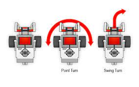

# Swing turn of a vehicle

## Introduction
An object is said to have done a swing turn if it revolves around around a point at a fixed radius away from the center of the object. A vehicle makes a swing turn when the wheel/wheels on one side of the vehicle rotates in one direction and the wheel on the other side doesnt rotate. The vehicle when doing a swing turn moves around in a circleas shown in figure.
</br>
A microcontroller such as arduino can be used to send appropriate signals to a motor driver such as a L298N which in turn drives the respective motors in desired direction.
</br>
The following image shows the difference between point turn and swing turn.

</br>
<p style="margin-top: 10px" align="center">
  
</p>
</br>

## Overview of few terms
### 1. PWM
<p>Which stands for pulse width modulation is a process of varying the time for which a pulse remains ON. This way the average power delivered by a signal can be controlled. The longer the pulse remains ON compared to its OFF time, the higher the total power supplied to the load.</p>
<p>Duty cyle represents the proportion of ON time of a pulse to its total time period. It is represented in percentage.</p>
</br>
<p align="left">
  
</p>
</br>
An Arduino uno has 6 PWM output pins (3,5,6,9,10,11) labeled with ~ sign. PWM signals can be given using the in-built function "analogWrite()" in Arduino IDE.
</br>

### 2. L298N
<p>L298N is a dual channel motor driver. The H bridge is used to control the direction of the motors by provding HIGH(1) and LOW(0) signals to the direction control pins (IN1,IN2,IN3,IN4).The speed can be controlled by proving PWM signals to these pins.</p>
<p align="left">
  
</p>

## Components and supplies
<ul>
<li>Arduino Uno X 1</li>
<li>DC motor(generic) X 4</li>
<li>Jumper wires(generic) X 1</li>
<li>L298N motor driver X 1</li>
<li>USB A to B cable X 1</li>
</ul>

## Working
The working of a vehicle carrying out a swing turn is simple. The Arduino sends a PWM signal to the L298N motor driver input pin which in turn drives the set of wheels on one side of the vehicle in clockwise direction. The Arduino send another PWM signal with 0% duty cycle so as to prevent the set of wheels on the other side from rotating.

## Code
Code used to program the arduino
<details>
<summary>Click to expand code...</summary>
<p>

```c++
int botSpeed = 100;

void setup() {
  // setting PWM output pins for controlling dc motors
  pinMode(5,OUTPUT);
  pinMode(6,OUTPUT);
  Serial.begin(9600); // for debugging
}

void loop() {
  // give pwm signals to respective digital pins to perform swing turn
  analogWrite(5,botSpeed); // turn left wheels clockwise
  analogWrite(6,0); // turn left wheels forward
}
```

</p>
</details>

## Resources
<ul>
<li>PWM:https://create.arduino.cc/projecthub/muhammad-aqib/arduino-pwm-tutorial-ae9d71</li>
<li>L298N:https://lastminuteengineers.com/l298n-dc-stepper-driver-arduino-tutorial/</li>
</ul>
